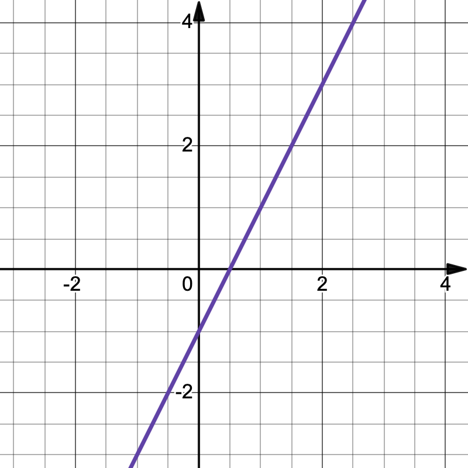
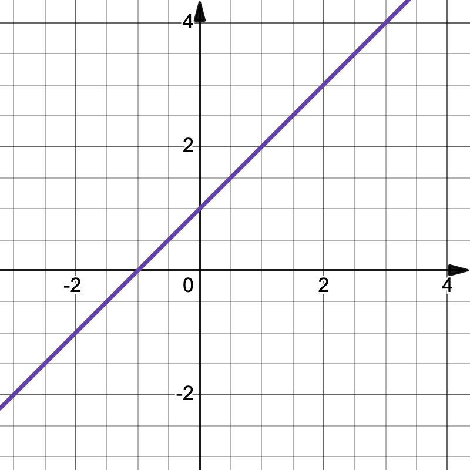
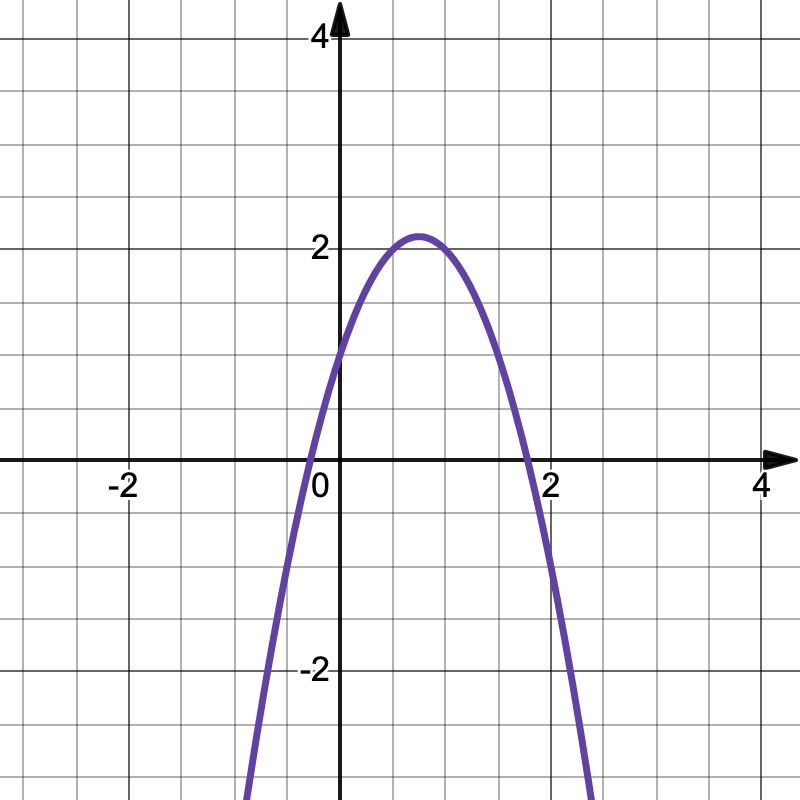
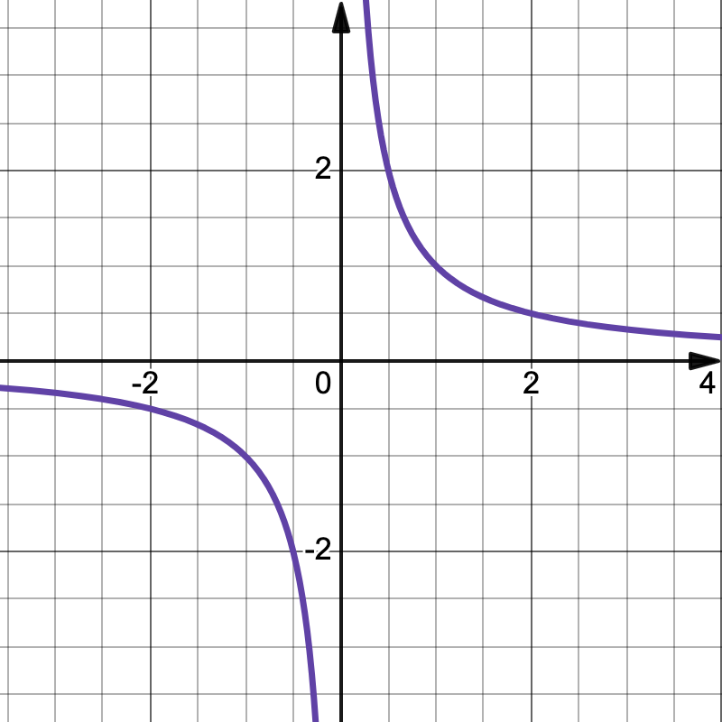
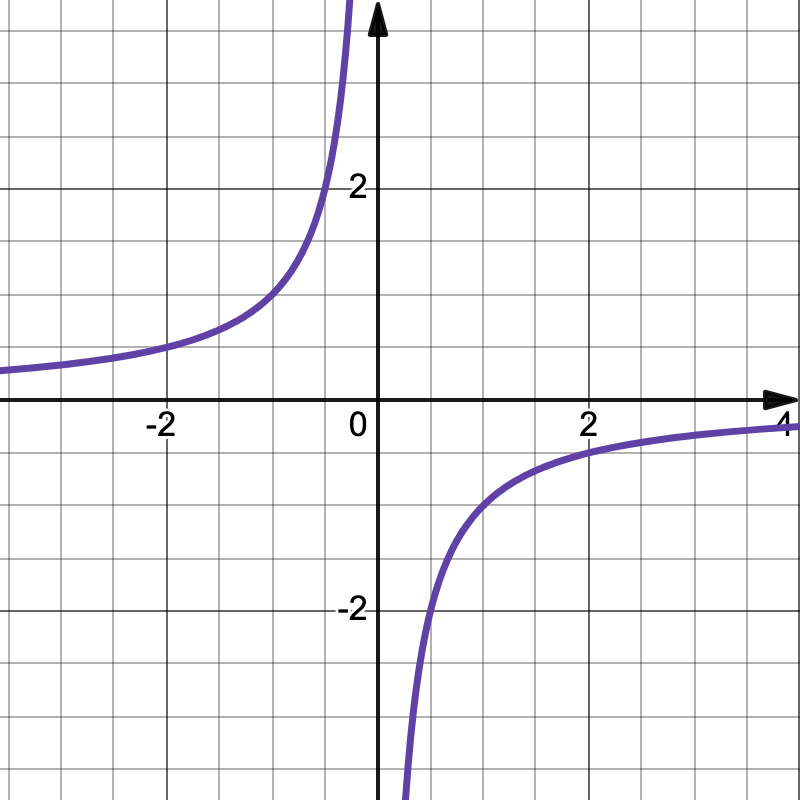
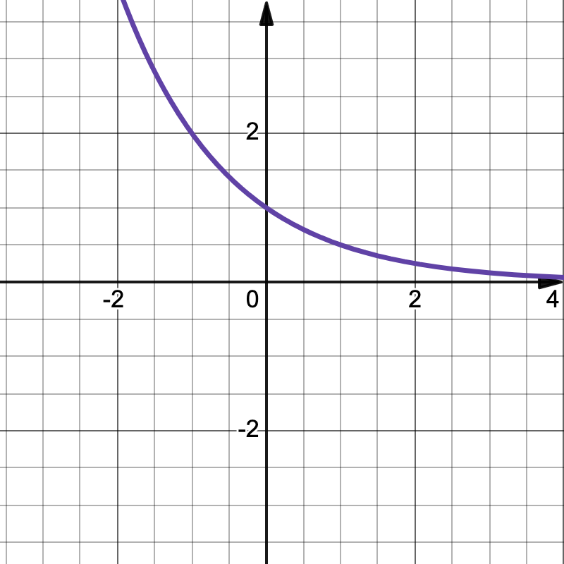
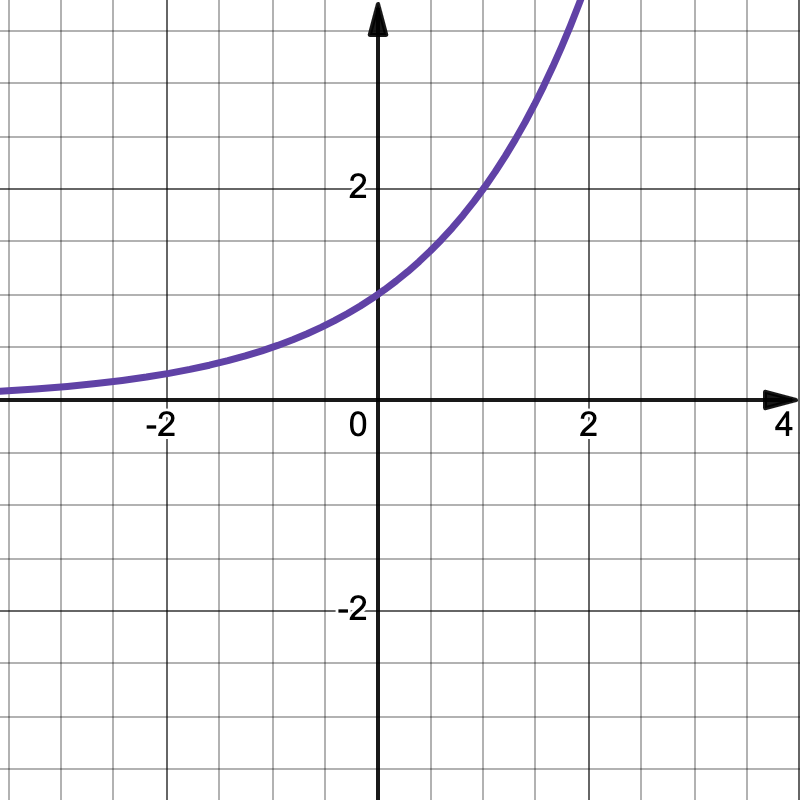
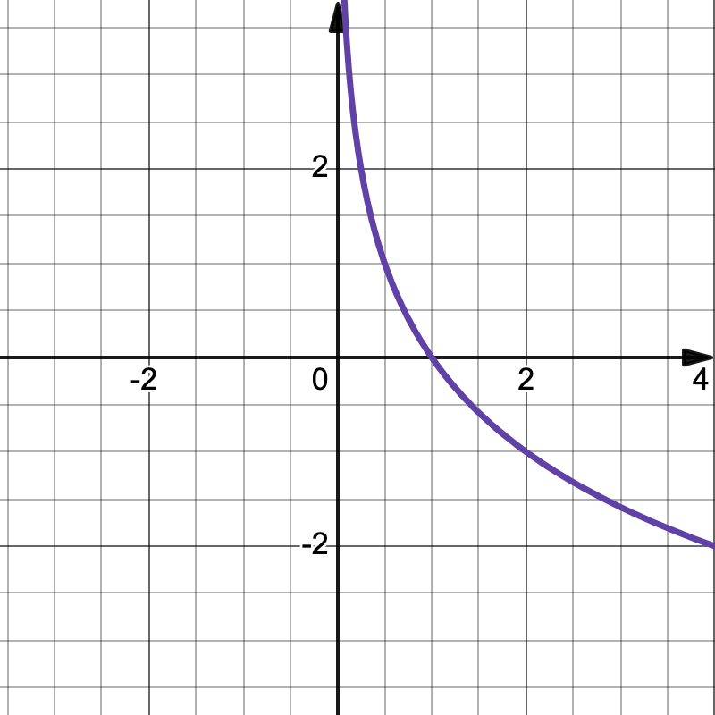
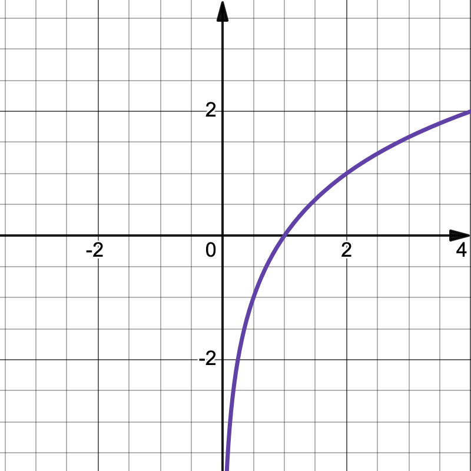
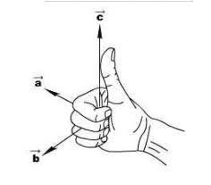

= 高数一
:toc:
:toc-title: 目录
:toclevels: 4
:chapter-signifier: 章节
:sectnums:
:scripts: cjk
:doctype: book
:stem:
:experimental:

== 基础
=== 常见常量的值
. latexmath:[\sin{0}=0]
. latexmath:[\cos{0}=1]
. latexmath:[e^0=1]
. latexmath:[\log_b{1}=0\Rightarrow\ln{1}=0]
. latexmath:[\log_b{b}=1\Rightarrow\ln{e}=1]

=== 常见的公式
* stem:[a^2-b^2=(a+b)(a-b)]
* stem:[a^2\pm2ab+b^2=(a+b)^2]
* stem:[a^3-b^3=(a-b)(a^2+ab+b^2)]
* stem:[ax^2+bx+c=0\Rightarrowx=\frac{-b\pm\sqrt{b^2-4ac}}{2a}]
** 如果 stem:[b=0]: stem:[ax^2+c=0\Rightarrowax^2=-c\Rightarrowx^2=-c/a\Rightarrowx=\pm\sqrt{-c/a}]
** 如果 stem:[c=0]: stem:[ax^2+bx=0\Rightarrow(ax+b)\cdotx=0\Rightarrowx=-b/a或x=0]
* stem:[ax^2+bx+c>=0]
.. 当成一元二次方程求出 stem:[x_1,x_2]
... 注意 `a` 如果不为正数要换算成正数，也就是两边同乘以 `-1`，换算时注意要改变大于小于号
.. 改写成 stem:[(x-x_1)\cdot(x-x_2)]
.. 同大取大，同小取小，两边取中间
* 三角函数
** stem:[\tanx=\frac{\sinx}{\cosx}]
** stem:[\cotx=\frac{\cosx}{\sinx}]
** stem:[\secx=\frac{1}{\cosx}]
** stem:[\cscx=\frac{1}{\sinx}]
* 指数
** stem:[a^0=1(a\ne0)]
** stem:[a^-n=1/a^n(a\ne0)]
** latexmath:[a^{m/n}=\sqrt[n\]{m}]
** stem:[a^m\timesa^n=a^{m+n}]
** stem:[a^m/a^n=a^{m-n}(a\ne0)]
** stem:[(a^m)^n=a^{m\timesn}]
** stem:[(ab)^n=a^n\timesb^n]
** stem:[(a/b)^n=a^n/b^n(b\ne0)]
* 对数
** 对数的换底公式: stem:[\log_b a = \frac{\log_k a}{\log_k b}]，其中，\(k\) 是任意正数（通常取10或e）。
** 对数的乘法法则: stem:[\log_b(x\cdoty)=\log_bx+\log_by]
** 对数的除法法则: stem:[\log_b \left(\frac{x}{y}\right) = \log_b x - \log_b y]
** 对数的幂法则: stem:[\log_b (x^k) = k \cdot \log_b x]

== 函数
=== 一次函数
. stem:[y=kx+b(k≠0)]
. 图像
+

image:2.1.3.一次函数.png[caption="图 2.1.3",title="y=-3x+3",alt="y=-3x+3",width=200]

=== 二次函数
. stem:[y=ax^2+bx+c(a≠0)]
. 对称轴: stem:[x=-\frac{b}{2a}]
. 开口方向:
.. stem:[a>0]: 开口向上
.. stem:[a<0]: 开口向下
. 顶点坐标: stem:[x=(-\frac{b}{2a},\frac{4ac-b^2}{4a})]
. 解方程: stem:[ax^2+bx+c=0 \to x=\frac{-b\pm\sqrt{b^2-4ac}}{2a}]
. 图像
+

=== 反比例函数
. stem:[y=\frac{k}{x}(k≠0)]
. stem:[k>0]
+
",alt="stem:[y=\frac{k}{x}]",width=200]
. stem:[k<0]
+
",alt="stem:[y=\frac{k}{x}]",width=200]

=== 指数函数
. stem:[y=a^x(a>0,a≠1)]
. stem:[0<a<1]
+
",alt="stem:[0<a<1]",width=200]
. stem:[a>1]
+
",alt="stem:[a>1]",width=200]

=== 对数函数
. 定义
+
stem:[\log_b a = c \quad \text{当且仅当} \quad b^c = a]，其中，\( b \) 是对数的底，\( a \) 是对数的真数，\( c \) 是对数值。
. stem:[y=\log_{a}x(a>0,a≠1)]
. stem:[0<a<1]
+
",alt="stem:[0<a<1]",width=200]
. stem:[a>1]
+
",alt="stem:[a>1]",width=200]

== 极限
=== 常见极限
. stem:[\lim_{x \to \infty}\frac{a}{x}=0]
. stem:[\lim_{x \to 0}\frac{a}{x}=\infty]
. stem:[\lim_{x \to 0}\frac{\sinx}{x}=1]
.. 带入后分子分母同时为 0
.. 上下一致性。
. stem:[\lim_{x \to \infty}(1+\frac{1}{x})^x=e]
.. e=2.71828
.. 一致性
.. 倒数关系

=== 极限的运算方法
. 直接法
. 公式法
. 分子分母同时除以 x 的最高项
. 洛必达法则

=== 无穷小
==== 定义
接近于 `0` 的时候
[NOTE]
====
注意是 `0` 而不是负数
====
==== 无穷小的比较
===== 等价无穷小
stem:[\lim_{x \to 0}\frac{a}{b}=1]

===== 同阶无穷小
stem:[\lim_{x \to 0}\frac{a}{b}=m(m≠1,常数)]

===== 高阶无穷小
stem:[\lim_{x \to 0}\frac{a}{b}=0]

===== 低阶无穷小
stem:[\lim_{x \to 0}\frac{a}{b}=\infty]

==== 无穷小的替换
当 x 接近于 `0` 时

* stem:[\sinx \to x]
* stem:[1-\cosx \to \frac{1}{2}x^2]
* stem:[\tanx \to x]
* stem:[\arctanx \to x]
* stem:[\arcsinx \to x]
* stem:[x^2-1 \to x\lna]
* stem:[\ln(1+x) \to x]，stem:[\ln(1+ax) \to ax]
* stem:[(1+\betax)^\alpha-1 \to \alpha\betax]

=== 渐近线
==== 定义
* 水平渐近线:
+
若 stem:[\lim_{x\to\infty}f(x)=b]，则 stem:[y=f(x)] 有水平渐近线 stem:[y=b]
* 垂直(铅直)渐近线:
+
若 stem:[\lim_{x\toa}=\infty]，则 stem:[y=f(x)] 有垂直(铅直)渐近线 stem:[x=a]
* 斜渐近线:
+
stem:[\lim_{x\to\infty}f(x)/x=a] 若 stem:[a\ne0]，则 stem:[y=f(x)] 有斜渐近线 stem:[y=ax+b(b=\lim_{x\to\infty}[f(x)-ax\])]

==== 解法
. 水平渐近线: 先通过 stem:[x\to\pm\infty] 时是否存在权限，来判断是否存在水平渐近线
** 一般用分子分母同时除以 x 的最高项即可得(注意: 如果分母算得 `0`，可判断无水平渐近线)
. 铅直(垂直)渐近线: 再通过 stem:[x\tox_0^+] 或 stem:[x\tox_0^-] 时是否权限为无穷(该 stem:[x_0] 为无定义点或其它符合间断点定义的点)，来判断是否存在垂直(铅直)渐近线
** 一般判断分母是否可以等于 `0`，分母=0 时 `x` 的值为垂直(铅直)渐近线
. 斜渐近线
**

=== 函数的连续性
==== 间断点
形式: stem:[y=\frac{1}{2x-1}]
分母不能为 `0`，stem:[x\ne1/2]，故函数 y 的间断点为 stem:[1/2]

==== 分段函数
形式: latexmath:[f(x)=
\begin{cases}
  & a-x^2 \\
  & x^2-1
\end{cases}
\begin{align*}
  & x\ge1\\
  & x<1
\end{align*}
]

==== 连续的定义
形式: latexmath:[f(x)=
\begin{cases}
  & a-x^2 \\
  & x^2-1
\end{cases}
\begin{align*}
  & x\ge1\\
  & x<1
\end{align*}
] 在 stem:[x=1] 处连续，既有 stem:[a-x^2=x^2-1]，把 `1` 代进去得 stem:[a=1]

==== 连续的判定方法
右极限=左极限=函数值
stem:[\lim_{x \to x_{0}^{+}}f(x)=\lim_{x \to x_{0}^{-}}f(x)=f(x_{0}) ]

== 导数
=== 导数的定义
stem:[\lim_{\Delta x \to 0} \frac{\Delta y}{\Delta x} = \lim_{\Delta x \to 0}\frac{f(x_{0}+\Delta x)-f(x_{0})}{\Delta x}]

=== 微分的定义
latexmath:[{\mathrm{d}y}={y}'{\mathrm{d}x}]

=== 积分的定义
stem:[\int f(x)dx=F(x)+C]

=== 导数的八个公式
. latexmath:[c'=0]
. latexmath:[{(x^n)}'=nx^{n-1}], latexmath:[{(nx)}'=n]
. latexmath:[{(a^{x})}'=a^x\ln{a}], latexmath:[{(e^{x})}'=e^x]，但是 latexmath:[{(e^{-x})}'=-e^{-x}]
. latexmath:[{(\log_ax)}'=\frac{1}{\ln{a}\cdot x}], latexmath:[{(\ln{x})}'=\frac{1}{x}]
. latexmath:[(\sin{x})'=\cos{x}]
. latexmath:[(\cos{x})'=-\sin{x}]
. latexmath:[(\arcsin{x})'=\frac{1}{\sqrt{1-x^2}}]
. latexmath:[(\arctan{x})'=\frac{1}{1+x^2}]

=== 导数的其余公式
. latexmath:[(e^{-x})'=-e^{-x}]
. latexmath:[(\tan{x})'=\sec^2{x}]
. latexmath:[(\cot{x})'=-\csc^2{x}]
. latexmath:[(\sec{x})'=\sec{x}\tan{x}]
. latexmath:[(\csc{x})'=-\csc{x}\cot{x}]
. latexmath:[(\arccos{x})'=-\frac{1}{\sqrt{1-x^2}}]
. latexmath:[(arc\cot{x})'=-\frac{1}{1+x^2}]

=== 导数的四则运算
. stem:[(u\pmv)'=u'\pmv']
. stem:[(Cu)'=Cu'](`C` 是常数)
. stem:[(uv)'=u'v+uv']
. stem:[(u/v)'=\frac{u'v-uv'}{v^2}]

=== 复合函数
* 定义: stem:[f[\phi(x)\]'=f'(u)\cdot\phi'(x)]

=== 切线方程
. 直线的定义
** 点斜式方程: stem:[y-y_0=k(x-x_0)]
. 斜率 stem:[k=f'(x_0)]
. 公式
** 两条直线平行: stem:[k_1=k_2]
** 两条直线垂直: stem:[k_1\cdotk_2=-1]
. 法线垂直切线

=== 高阶导数
* 求导法则: 先求一阶导数，在一阶导数的基础上再继续求导

=== 隐函数
* 本质: `y` 是含有 `x` 的式子
* 方法: 等式两边同时求导

=== 洛必达法则
. 适用范围
+
stem:[\lim_{x \to x_0}\frac{f(x)}{g(x)}]，其中 stem:[f(x_0)/g(x_0)=0/0] 或者 stem:[\infty/\infty]
. 公式
+
stem:[\lim_{x \to x_0}\frac{f(x)}{g(x)}=\lim_{x \to x_0}\frac{f'(x)}{g'(x)}=\frac{f'(x)}{g'(x)}]
. 方法
+
分子分母同时求导，如果分母仍为 `0`，继续求导，直到分母不为 `0`，将趋向的值代入可解

=== 导数的应用
==== 函数定义域
自变量 `x` 的取值范围:

* 分母不为 `0`: 例如 stem:[y=1/{x-1}\tox-1\ne0\tox\ne1]
* stem:[\sqrt{ax+b}\toax+b>=0]
* stem:[y=\log_a^x\tox>0]，`ln` 和 `lg` 也一样

==== 单调性
* 单调递增(增函数)
* 单调递减(减函数)

* 在区间 stem:[(a,b)] 中，如果 stem:[f'(x)>0]，则单调递增
* 在区间 stem:[(a,b)] 中，如果 stem:[f'(x)<0]，则单调递减

==== 极值点、拐点和极值
* 若 stem:[f'(x_0)=0]，stem:[x_0] 叫做极值点、驻点，stem:[f(x_0)]叫做极值。
* 若 stem:[f''(x_0)=0]，(stem:[x_0]，stem:[y_0])叫做拐点。

==== 极大值和极小值的定义
* 极大值: 先增后减
* 极小值: 先减后增

==== 函数的凹凸性
* 在区间 stem:[(a,b)] 中，如果 stem:[f''(x)>0]，则是凹函数
* 在区间 stem:[(a,b)] 中，如果 stem:[f''(x)<0]，则是凸函数

==== 单调性和极值解题方法
. 写出定义域
. 求出 stem:[f'(x)]
. 令 stem:[f'(x)=0]，求出 `x` 的值
. 列表
. 填表分析出极大、极小值

== 积分
=== 常用公式
* stem:[\intkdx=kx+C]
* stem:[\intx^adx=\frac{x^{a+1}}{a+1}+C(a\ne-1)]
* stem:[\int1/xdx=ln|x|+C]
* stem:[\inta^xdx=a^x/\lna+C]
* stem:[\inte^xdx=e^x+C]
* stem:[\int\sinxdx=-\cosx+C]
* stem:[\int\cosxdx=\sinx+C]
* stem:[\int1/{x^2+1}dx=\arctanx+C]
* stem:[\int1/\sqrt{1-x^2}dx=\arcsinx+C]

=== 其它公式

== 向量
=== 基本概念
==== 向量的定义
既有大小又有方向的量称为向量

* 以 A 为起点，B 为终点的有向线段所表示的向量记作 latexmath:[\vec{AB}]
* 类似物理中的矢量，而物理中的标量则是只有大小，没有方向
* 若两个向量 stem:[\veca] 与 stem:[\vecb] 大小相等，且方向相同，则 stem:[\veca=\vecb]

==== 向量的模
向量的大小叫做向量的模

* latexmath:[\vec{AB}] 的模记作 latexmath:[|\vec{AB}|]，stem:[\veca] 记作 stem:[|\veca|]

==== 单位向量
模等于 1 的向量，记作 stem:[\vec{a^\circ}]，公式: stem:[\vec{a^\circ}=\veca/|\veca|]

==== 负向量
与向量 stem:[\veca] 的模相等而方向相反的向量

==== 零向量
模等于 0 的向量(零向量的方向是任意的)

=== 向量的夹角
设两个非零向量 stem:[\veca] 与 stem:[\vecb]，任取空间一点 `O`，作 latexmath:[\vec{OA}=\vec{a},\vec{OB}=\vec{b}]，则称 stem:[\angle\phi=\angleAOB] 为 stem:[\veca] 与 stem:[\vecb] 的夹角，记作 stem:[<\veca,\vecb> =\phi(0<=\phi<=\pi)]

* 若 stem:[<\veca,\vecb> =] `0` 或 `𝜋`，则称向量 stem:[\veca 与 \vecb] 平行或共线，记作 stem:[\veca////\vecb]
* 若 stem:[<\veca,\vecb> =\pi/2]，则称向量 stem:[\veca 与 \vecb] 垂直，记作 latexmath:[\vec{a}\perp\vec{b}]

=== 向量的表示方法
* 在空间取定一点 `O` 和三个两两垂直的单位向量 stem:[\veci,\vecj,\veck]，就确定了三条都以 `O` 为原点的两两垂直的数轴，依次记为 `x` 轴、`y` 轴、`z` 轴，它们构成一个空间直角坐标系，称为 stem:[O_{xyz}] 坐标系
* 若 `x`、`y`、`z` 分别是向量 stem:[\veca] (起点为 `O`)在 `x` 轴、`y` 轴、`z` 轴上的投影，则向量 stem:[\veca=x\veci+y\vecj+z\veck=(x,y,z)]
* 向量坐标可用小括号，也可用大括号

=== 向量的模长
stem:[|\veca|=\sqrt{x^2+y^2+z^2}]

=== 空间中两点间的距离
设点 stem:[M_1(x_1,y_1,z_1)] 与点 stem:[M_2(x_2,y_2,z_2)]，其间距离: stem:[|M_1M_2|=\sqrt{(x_2-x_1)^2+(y_2-y_1)^2+(z_2-z_1)^2}]

=== 两点构成的向量
由点 stem:[M(a_1,b_1,c_1)] 与点 stem:[N(a_2,b_2,c_2)] 构成的向量: latexmath:[\vec{MN}=(a_2-a_1,b_2-b_1,c_2-c_1)]

=== 单位向量
. 单位向量: 模长为 `1` 的向量
. 计算公式: stem:[\vec{a^\circ}=\veca/|\veca|]
. 平行公式: stem:[\vec{a^\circ}=\pm\veca/|\veca|](负号是因为有可能为反向，也是平行的)

=== 向量的线性运算
设 stem:[\veca=(a_x,a_y,a_z)]，stem:[\vecb=(b_x,b_y,b_z)]

. stem:[\veca+\vecb=(a_x+b_x,a_y+b_y,a_z+b_z)]
. stem:[\veca-\vecb=(a_x-b_x,a_y-b_y,a_z-b_z)]
. stem:[\lambda\veca=(\lambdaa_x,\lambdaa_y,\lambdaa_z)]
. stem:[\lambda(\mu\veca)=\mu(\lambda\veca)=(\lambda\mu)\veca]
. stem:[(\lambda+\mu)\veca=\lambda\veca+\mu\veca]
. stem:[\lambda(\veca+\vecb)=\lambda\veca+\lambda\vecb]

=== 方向余弦
==== 计算过程
设 stem:[\veca=a_1\veci+a_2\vecj+a_3\veck]，当 stem:[\veca\ne\vec0] 时，与 stem:[\veca] 同方向的单位向量:

stem:[\vec{a^\circ}=\veca/|veca|=\frac{(a_1\veci+a_2\vecj+a_3\veck)}{|\veca|}=a_1/|\veca|\veci+a_2/|\veca|\vecj+a_3/|\veca|\veck]

设 \[
\left\{\begin{matrix}
  \alpha: & \vec{a}与 x 轴方向的夹角 \\
  \beta: & \vec{a}与 y 轴方向的夹角\\
  \gamma: & \vec{a}与 z 轴方向的夹角
\end{matrix}\right.
\]

得 stem:[a_1/|veca|=\cos\alpha]，stem:[a_2/|veca|=\cos\beta]，stem:[a_3/|veca|=\cos\gamma]

所以 stem:[\vec{a^\circ}=\cos\alpha\veci+\cos\beta\vecj+\cos\gamma\veck]，且 stem:[\cos^2\alpha+\cos\^2beta+\cos^2\gamma=1]

==== 注意条件
. 向量角 stem:[\alpha,\beta,\gamma\in[0,\pi\]]
. stem:[\cos^2\alpha+\cos\^2beta+\cos^2\gamma=1]

=== 数量积
==== 定义
设 stem:[\veca 与 \vecb] 的夹角为 stem:[\theta]，则称 stem:[\vec{a}\cdot\vec{b}=|\veca||vecb|\cos\theta] 为 stem:[\veca 与 \vecb] 的数量积(也叫点积、内积、标量积)

==== 性质
. stem:[\veca\cdot\veca=|\veca|^2\Rightarrow|\veca|=\sqrt{\veca\cdot\veca}]
. 设 stem:[\veca,\vecb] 为两个非零向量，则 stem:[\veca\cdot\vecb=0\Leftrightarrow\veca\bot\vecb]

==== 运算
. 交换律: stem:[\veca\cdot\vecb=\vecb\cdot\veca]
. 结合律:
.. stem:[(\lambda\veca)\cdot\vecb=\veca\cdot(\lambda\vecb)=\lambda(\veca\cdot\vecb)]
.. stem:[(\lambda\veca)(\mu\vecb)=\lambda\mu(\veca\cdot\vecb)]
. 分配律: stem:[(\veca+\vecb)\cdot\vecc=\veca\cdot\vecc+\vecb\cdot\vecc]

==== 坐标表示
设 stem:[\veca=(a_x,a_y,a_z),\vecb=(b_x,b_y,b_z)]，则 stem:[\veca\cdot\vecb=a_xb_x+a_yb_y+a_zb_z]

=== 向量积
==== 定义
两向量 stem:[\veca与\vecb] 的向量积是一个向量 stem:[\vecc]，记为 stem:[\vecc=\veca\times\vecb]，且满足:

. stem:[\vecc] 的模: stem:[|\vecc|=|\veca||\vecb|\sin<\veca,\vecb>]
. stem:[\vecc] 的方向: 垂直于 stem:[\veca和\vecb] 所确定的平面(stem:[\veca与\vecb] 是不共线的非零向量)，即 latexmath:[\vec{c}\perp\vec{a},\vec{c}\perp\vec{b}]，且符合右手法则
+
[NOTE]
====
右手法则是指伸展右手，四指按从 stem:[\veca] 的方向转过角度 stem:[<\veca,\vecb>] 与 stem:[\vecb] 的方向重合的旋转方向握拳，大拇指的方向即为 stem:[\vecc] 的方向 
====
. 向量积的结果是一个法向量

==== 向量积的几何意义
stem:[|\vecc|=|\veca\times\vecb|=|\veca||\vecb|\sin\theta =>] 向量积的模是以 stem:[\veca与\vecb] 为邻边的平行四边形的面积

==== 性质
. stem:[\veca\times\veca=\vec0]
. stem:[\veca\times\vecb=\vec0 <=> \veca //// \vecb]

==== 运算
. 交换律: stem:[\veca\times\vecb=-\vecb\times\veca] (注意负号)
. 分配律: stem:[(\veca+\vecb)\times\vecc=\veca\times\vecc+\vecb\times\vecc]
. 结合律: stem:[(\lambda\veca)\times\vecb=\veca\times(\lambda\vecb)=\lambda(\veca\times\vecb)]

==== 向量积的坐标表示
设 stem:[\veca=a_1\veci+a_2\vecj+a_3\veck=(a_1,a_2,a_3),\vecb=b_1\veci+b_2\vecj+b_3\veck=(b_1,b_2,b_3)]

那么

latexmath:[\vec{a}\times\vec{b}=\begin{vmatrix}
\vec{i} & \vec{j} & \vec{k}\\
a_1 & a_2 & a_3\\
b_1 & b_2 & b_3
\end{vmatrix}=\begin{vmatrix}
a_2 & a_3\\
b_2 & b_3
\end{vmatrix}\vec{i}-\begin{vmatrix}
a_1 & a_3\\
b_1 & b_3
\end{vmatrix}\vec{j}+\begin{vmatrix}
\vec{a_1} & \vec{a_2}\\
\vec{b_1} & \vec{b_2}
\end{vmatrix}]

stem:[=(a_2b_3-a_3b_2)\vec{i}-(a_1b_3-a_3b_1)\vec{j}+(a_1b_2-a_2b_1)\vec{k}]

=== 向量间的关系
==== 平行或垂直
设向量 stem:[\veca=(a_x,a_y,a_z),\vecb=(b_x,b_y,b_z)]，其中，stem:[\lambda] 为实数，stem:[\theta] 为 stem:[\veca与\vecb] 的夹角，则

* stem:[\veca////\vecb]
** stem:[<=> \theta=0或\pi]
** stem:[<=> \veca=\lambda\vecb]
** stem:[<=> a_x/b_x=a_y/b_y=a_z/b_z]
** stem:[<=> \veca\times\vecb=\vec0]
* latexmath:[\vec{a}\perp\vec{b}]
** stem:[<=> \theta=pi/2]
** stem:[<=> \veca\cdot\vecb=0]
** stem:[<=> a_xb_x+a_yb_y+a_zb_z=0]

==== 投影
stem:[\veca在\vecb] 上的投影，记作 stem:[\Prj_ba=|\veca|\cdot\cos\theta=\frac{\veca\cdot\vecb}{|\vecb|}](`Prj` 是 `Projection` 的缩写)