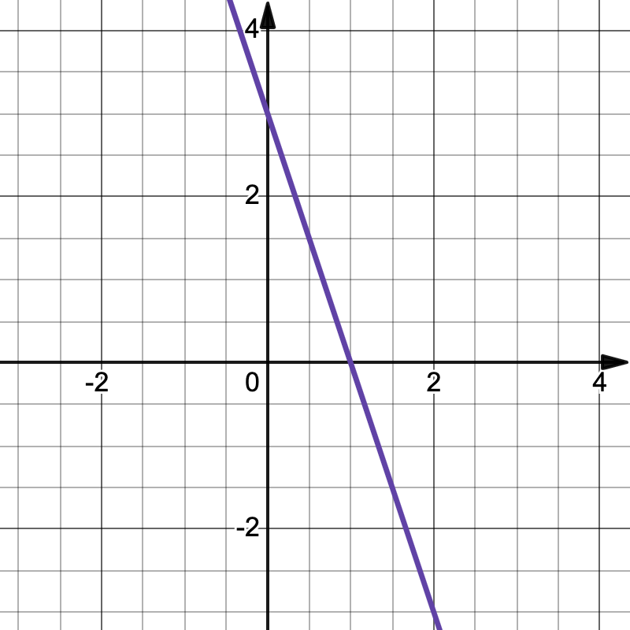

= 高数一
:toc:
:toc-title: 目录
:toclevels: 4
:chapter-signifier: 章节
:sectnums:
:scripts: cjk
:doctype: book
:stem:
:experimental:

== 基础
=== 常见常量的值
. latexmath:[\sin{0}=0]
. latexmath:[\cos{0}=1]
. latexmath:[e^0=1]
. latexmath:[\log_b{1}=0\to\ln{1}=0]
. latexmath:[\log_b{b}=1\to\ln{e}=1]

=== 常见的公式
* 分式
** stem:[a^-n=1/a^n]
** latexmath:[\sqrt[n\]{x^m}=x^{\frac{m}{n}}]
* stem:[a^2-b^2=(a+b)(a-b)]
* stem:[a^2\pm2ab+b^2=(a+b)^2]
* stem:[a^3-b^3=(a-b)(a^2+ab+b^2)]
* stem:[ax^2+bx+c=0\tox=\frac{-b\pm\sqrt{b^2-4ac}}{2a}]
** 如果 stem:[b=0]: stem:[ax^2+c=0\toax^2=-c\tox^2=-c/a\tox=\pm\sqrt{-c/a}]
** 如果 stem:[c=0]: stem:[ax^2+bx=0\to(ax+b)\cdotx=0\tox=-b/a或x=0]
* stem:[ax^2+bx+c>=0]
.. 当成一元二次方程求出 stem:[x_1,x_2]
... 注意 `a` 如果不为正数要换算成正数，也就是两边同乘以 `-1`，换算时注意要改变大于小于号
.. 改写成 stem:[(x-x_1)\cdot(x-x_2)]
.. 同大取大，同小取小，两边取中间
* 三角函数
** stem:[\tanx=\frac{\sinx}{\cosx}]
** stem:[\cotx=\frac{\cosx}{\sinx}]
** stem:[\secx=\frac{1}{\cosx}]
** stem:[\cscx=\frac{1}{\sinx}]
* 对数
** 对数的换底公式: stem:[\log_b a = \frac{\log_k a}{\log_k b}]，其中，\(k\) 是任意正数（通常取10或e）。
** 对数的乘法法则: stem:[\log_b(x\cdoty)=\log_bx+\log_by]
** 对数的除法法则: stem:[\log_b \left(\frac{x}{y}\right) = \log_b x - \log_b y]
** 对数的幂法则: stem:[\log_b (x^k) = k \cdot \log_b x]

== 函数
=== 一次函数
. stem:[y=kx+b(k≠0)]
. 图像
+

=== 二次函数
. stem:[y=ax^2+bx+c(a≠0)]
. 对称轴: stem:[x=-\frac{b}{2a}]
. 开口方向:
.. stem:[a>0]: 开口向上
.. stem:[a<0]: 开口向下
. 顶点坐标: stem:[x=(-\frac{b}{2a},\frac{4ac-b^2}{4a})]
. 解方程: stem:[ax^2+bx+c=0 \to x=\frac{-b\pm\sqrt{b^2-4ac}}{2a}]
. 图像
+

=== 反比例函数
. stem:[y=\frac{k}{x}(k≠0)]
. stem:[k>0]
+
",alt="stem:[y=\frac{k}{x}]",width=200]
. stem:[k<0]
+
",alt="stem:[y=\frac{k}{x}]",width=200]

=== 指数函数
. stem:[y=a^x(a>0,a≠1)]
. stem:[0<a<1]
+
",alt="stem:[0<a<1]",width=200]
. stem:[a>1]
+
",alt="stem:[a>1]",width=200]

=== 对数函数
. 定义
+
stem:[\log_b a = c \quad \text{当且仅当} \quad b^c = a]，其中，\( b \) 是对数的底，\( a \) 是对数的真数，\( c \) 是对数值。
. stem:[y=\log_{a}x(a>0,a≠1)]
. stem:[0<a<1]
+
",alt="stem:[0<a<1]",width=200]
. stem:[a>1]
+
",alt="stem:[a>1]",width=200]

== 极限
=== 常见极限
. stem:[\lim_{x \to \infty}\frac{a}{x}=0]
. stem:[\lim_{x \to 0}\frac{a}{x}=\infty]
. stem:[\lim_{x \to 0}\frac{\sinx}{x}=1]
.. 带入后分子分母同时为 0
.. 上下一致性。
. stem:[\lim_{x \to \infty}(1+\frac{1}{x})^x=e]
.. e=2.71828
.. 一致性
.. 倒数关系

=== 极限的运算方法
. 直接法
. 公式法
. 分子分母同时除以 x 的最高项
. 洛必达法则

=== 无穷小
==== 定义
接近于 `0` 的时候
[NOTE]
====
注意是 `0` 而不是负数
====
==== 无穷小的比较
===== 等价无穷小
stem:[\lim_{x \to 0}\frac{a}{b}=1]

===== 同阶无穷小
stem:[\lim_{x \to 0}\frac{a}{b}=m(m≠1,常数)]

===== 高阶无穷小
stem:[\lim_{x \to 0}\frac{a}{b}=0]

===== 低阶无穷小
stem:[\lim_{x \to 0}\frac{a}{b}=\infty]

==== 无穷小的替换
当 x 接近于 `0` 时

* stem:[\sinx \to x]
* stem:[1-\cosx \to \frac{1}{2}x^2]
* stem:[\tanx \to x]
* stem:[\arctanx \to x]
* stem:[\arcsinx \to x]
* stem:[x^2-1 \to x\lna]
* stem:[\ln(1+x) \to x]，stem:[\ln(1+ax) \to ax]
* stem:[(1+\betax)^\alpha-1 \to \alpha\betax]

=== 渐近线
==== 定义
* 水平渐近线:
+
stem:[x\to+\infty或-\infty]，stem:[y\toc]，stem:[y=c] 就是 stem:[f(x)] 的水平渐近线
* 铅直(垂直)渐近线:
+
stem:[x\toa]时，stem:[y\to+\infty或-\infty]，stem:[x=a] 就是 stem:[f(x)] 的铅直渐近线

==== 解法
* 水平渐近线: 求极限 stem:[\lim_{x\to\infty}]，一般用分子分母同时除以 x 的最高项即可得
* 铅直(垂直)渐近线: 分母=0 时 `x` 的值

=== 函数的连续性
==== 间断点
形式: stem:[y=\frac{1}{2x-1}]
分母不能为 `0`，stem:[x\ne1/2]，故函数 y 的间断点为 stem:[1/2]

==== 分段函数
形式: latexmath:[f(x)=
\begin{cases}
  & a-x^2 \\
  & x^2-1
\end{cases}
\begin{align*}
  & x\ge1\\
  & x<1
\end{align*}
]

==== 连续的定义
形式: latexmath:[f(x)=
\begin{cases}
  & a-x^2 \\
  & x^2-1
\end{cases}
\begin{align*}
  & x\ge1\\
  & x<1
\end{align*}
] 在 stem:[x=1] 处连续，既有 stem:[a-x^2=x^2-1]，把 `1` 代进去得 stem:[a=1]

==== 连续的判定方法
右极限=左极限=函数值
stem:[\lim_{x \to x_{0}^{+}}f(x)=\lim_{x \to x_{0}^{-}}f(x)=f(x_{0}) ]

== 导数
=== 导数的定义
stem:[\lim_{\Delta x \to 0} \frac{\Delta y}{\Delta x} = \lim_{\Delta x \to 0}\frac{f(x_{0}+\Delta x)-f(x_{0})}{\Delta x}]

=== 微分的定义
latexmath:[{\mathrm{d}y}={y}'{\mathrm{d}x}]

=== 积分的定义
stem:[\int f(x)dx=F(x)+C]

=== 导数的八个公式
. latexmath:[c'=0]
. latexmath:[{(x^n)}'=nx^{n-1}], latexmath:[{(nx)}'=n]
. latexmath:[{(a^{x})}'=a^x\ln{a}], latexmath:[{(e^{x})}'=e^x]，但是 latexmath:[{(e^{-x})}'=-e^{-x}]
. latexmath:[{(\log_ax)}'=\frac{1}{\ln{a}\cdot x}], latexmath:[{(\ln{x})}'=\frac{1}{x}]
. latexmath:[(\sin{x})'=\cos{x}]
. latexmath:[(\cos{x})'=-\sin{x}]
. latexmath:[(\arcsin{x})'=\frac{1}{\sqrt{1-x^2}}]
. latexmath:[(\arctan{x})'=\frac{1}{1+x^2}]

=== 导数的其余公式
. latexmath:[(e^{-x})'=-e^{-x}]
. latexmath:[(\tan{x})'=\sec^2{x}]
. latexmath:[(\cot{x})'=-\csc^2{x}]
. latexmath:[(\sec{x})'=\sec{x}\tan{x}]
. latexmath:[(\csc{x})'=-\csc{x}\cot{x}]
. latexmath:[(\arccos{x})'=-\frac{1}{\sqrt{1-x^2}}]
. latexmath:[(arc\cot{x})'=-\frac{1}{1+x^2}]

=== 导数的四则运算
. stem:[(u\pmv)'=u'\pmv']
. stem:[(Cu)'=Cu'](`C` 是常数)
. stem:[(uv)'=u'v+uv']
. stem:[(u/v)'=\frac{u'v-uv'}{v^2}]

=== 复合函数
* 定义: stem:[f[\phi(x)\]'=f'(u)\cdot\phi'(x)]

=== 切线方程
. 直线的定义
** 点斜式方程: stem:[y-y_0=k(x-x_0)]
. 斜率 stem:[k=f'(x_0)]
. 公式
** 两条直线平行: stem:[k_1=k_2]
** 两条直线垂直: stem:[k_1\cdotk_2=-1]
. 法线垂直切线

=== 高阶导数
* 求导法则: 先求一阶导数，在一阶导数的基础上再继续求导

=== 隐函数
* 本质: `y` 是含有 `x` 的式子
* 方法: 等式两边同时求导

=== 洛必达法则
. 适用范围
+
stem:[\lim_{x \to x_0}\frac{f(x)}{g(x)}]，其中 stem:[f(x_0)/g(x_0)=0/0] 或者 stem:[\infty/\infty]
. 公式
+
stem:[\lim_{x \to x_0}\frac{f(x)}{g(x)}=\lim_{x \to x_0}\frac{f'(x)}{g'(x)}=\frac{f'(x)}{g'(x)}]
. 方法
+
分子分母同时求导，如果分母仍为 `0`，继续求导，直到分母不为 `0`，将趋向的值代入可解

=== 导数的应用
==== 函数定义域
自变量 `x` 的取值范围:

* 分母不为 `0`: 例如 stem:[y=1/{x-1}\tox-1\ne0\tox\ne1]
* stem:[\sqrt{ax+b}\toax+b>=0]
* stem:[y=\log_a^x\tox>0]，`ln` 和 `lg` 也一样

==== 单调性
* 单调递增(增函数)
* 单调递减(减函数)

* 在区间 stem:[(a,b)] 中，如果 stem:[f'(x)>0]，则单调递增
* 在区间 stem:[(a,b)] 中，如果 stem:[f'(x)<0]，则单调递减

==== 极值点、拐点和极值
* 若 stem:[f'(x_0)=0]，stem:[x_0] 叫做极值点、驻点，stem:[f(x_0)]叫做极值。
* 若 stem:[f''(x_0)=0]，(stem:[x_0]，stem:[y_0])叫做拐点。

==== 极大值和极小值的定义
* 极大值: 先增后减
* 极小值: 先减后增

==== 函数的凹凸性
* 在区间 stem:[(a,b)] 中，如果 stem:[f''(x)>0]，则是凹函数
* 在区间 stem:[(a,b)] 中，如果 stem:[f''(x)<0]，则是凸函数

==== 单调性和极值解题方法
. 写出定义域
. 求出 stem:[f'(x)]
. 令 stem:[f'(x)=0]，求出 `x` 的值
. 列表
. 填表分析出极大、极小值

== 积分
=== 常用公式
* stem:[\intkdx=kx+C]
* stem:[\intx^adx=\frac{x^{a+1}}{a+1}+C(a\ne-1)]
* stem:[\int1/xdx=ln|x|+C]
* stem:[\inta^xdx=a^x/\lna+C]
* stem:[\inte^xdx=e^x+C]
* stem:[\int\sinxdx=-\cosx+C]
* stem:[\int\cosxdx=\sinx+C]
* stem:[\int1/{x^2+1}dx=\arctanx+C]
* stem:[\int1/\sqrt{1-x^2}dx=\arcsinx+C]

=== 其它公式